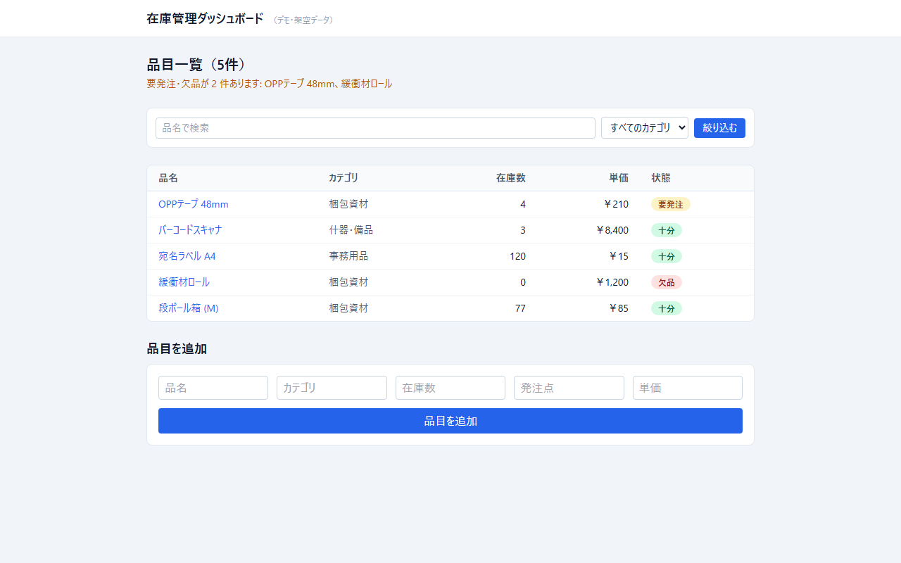
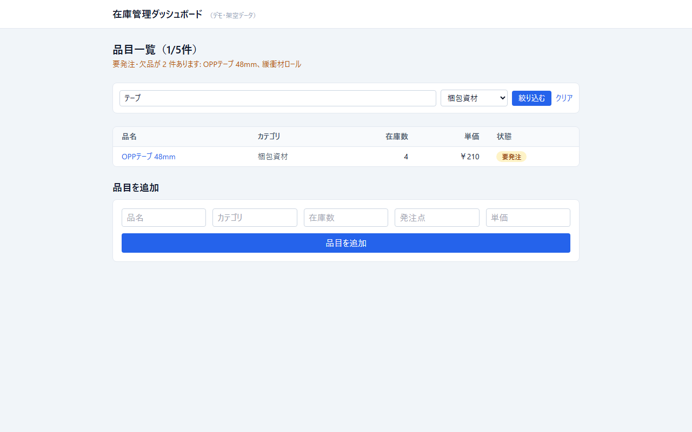
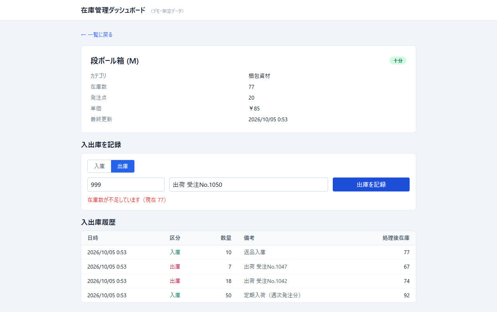
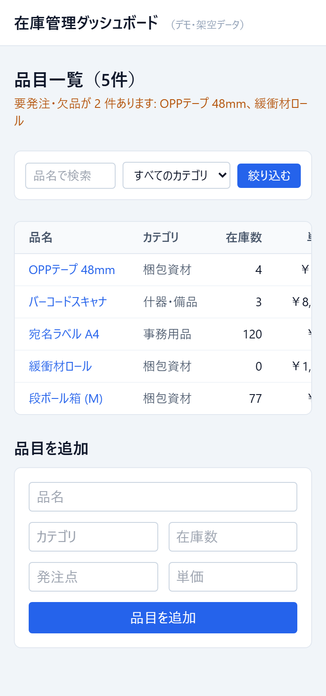

# 在庫管理ダッシュボード（デモ・架空データ）

小規模な在庫管理システムの制作例。Next.js（App Router）+ React + TypeScript + Tailwind CSS で構築。
業務で受託した案件ではなく、**すべて架空データ**（`data/items.json`）で作成した自主制作のサンプルです。

## スクリーンショット
| 品目一覧（要発注・欠品の警告） | カテゴリ・品名での絞り込み |
|---|---|
|  |  |

| 品目詳細（入出庫フォームと履歴・在庫不足エラー） | モバイル表示（375px） |
|---|---|
|  |  |

## 機能
- 品目一覧（品名・カテゴリ・在庫数・単価・状態）
- 在庫数と発注点の比較による状態表示（十分／要発注／欠品）
- 品目の追加（フォーム→API→一覧に即反映）
- 品目の詳細ページ（動的ルーティング）
- 入出庫の記録（品目詳細のフォーム→`POST /api/items/[id]/movements`）。出庫で在庫がマイナスになる場合は400「在庫数が不足しています（現在 N）」、存在しない品目は404。履歴（日時はAsia/Tokyo・区分・数量・備考・処理後在庫）を品目に保持し、新しい順に表示。履歴の無い既存データもそのまま動く
- 一覧のカテゴリ絞り込み（`?category=`）と品名の部分一致検索（`?q=`）。サーバーコンポーネント側で処理（JS不要のGETフォーム）
- 入力バリデーション（`lib/validate.ts`、依存ライブラリなしの手書き）。品名は必須（100文字以内）、カテゴリは文字列（50文字以内・省略可）、在庫数・発注点・単価は0以上の整数（在庫数・発注点は100万、単価は1億円まで）。JSON以外・オブジェクト以外（`null`・配列など）・真偽値/小数/文字列の数値は400で日本語のエラーメッセージを返し、想定外のサーバーエラーは詳細を伏せて500を返す

## 技術構成
- **Next.js 14**（App Router）: ページ（`app/page.tsx`・`app/items/[id]/page.tsx`）と API ルート（`app/api/items/route.ts`）を同一プロジェクトで実装
- **React**: `components/` にテーブル・バッジ・フォームをコンポーネント分割。フォームは `'use client'` の Client Component
- **TypeScript**: `lib/types.ts` で型定義（`InventoryItem`）と状態判定ロジック（`stockStatus`）を実装。`strict: true`
- **Tailwind CSS**: レスポンシブなテーブル・フォームレイアウト
- データ層はJSONファイル（`lib/store.ts`）。実運用ではDBに差し替える想定だが、読み書きのインターフェースは同じ形にしてある

## 動作確認方法
コードレビューだけでなく、実際にビルド・起動して検証している。

```bash
npm install
npm run typecheck   # tsc --noEmit
npm run build       # 本番ビルド（型チェック含む）
npm run start &      # http://localhost:3000
node smoke-test.mjs  # 追加→一覧反映→低在庫表示→バリデーション400→404 を自動検証（終了時に data/items.json を元に戻す）
```

`smoke-test.mjs` は次を確認する:
- 品目追加のPOSTが201を返し、一覧件数が1件増える
- 追加した品目名（日本語）がGET/画面表示の両方で正しく往復する
- 在庫数が発注点以下のとき、一覧画面に低在庫の警告が表示される
- 在庫数マイナス・品名未入力・`null`ボディ・真偽値/小数の在庫数・オブジェクトのカテゴリはAPIが400で拒否する
- 保存先は環境変数 `DATA_FILE` で差し替え可能（既定は `data/items.json`）
- 存在しない品目IDの詳細ページは404になる
- 入庫で在庫が増え、履歴に記録される／在庫を超える出庫は日本語メッセージつきで400／存在しない品目への入出庫は404／数量0・小数・不正な区分・101文字の備考は400
- カテゴリ絞り込み・品名検索の結果と、該当なし時のメッセージが表示される

ブラウザでの表示は 375px（モバイル）・768px（タブレット）・1280px（デスクトップ）の3幅で目視確認済み（テーブルは横スクロールで崩れない）。

## ディレクトリ構成
```
app/
  layout.tsx           ルートレイアウト
  page.tsx             品目一覧・追加フォーム
  items/[id]/page.tsx  品目詳細
  api/items/route.ts   GET(一覧) / POST(追加)
  api/items/[id]/movements/route.ts  POST(入出庫)
components/
  ItemTable.tsx  StockBadge.tsx  NewItemForm.tsx  MovementForm.tsx  ItemFilter.tsx
lib/
  types.ts   型定義・状態判定ロジック
  store.ts   データ読み書き
data/
  items.json 架空データ（5件の初期シード）
docs/screenshots/  README用スクリーンショット
smoke-test.mjs  起動中のサーバーに対する自動検証スクリプト
```
